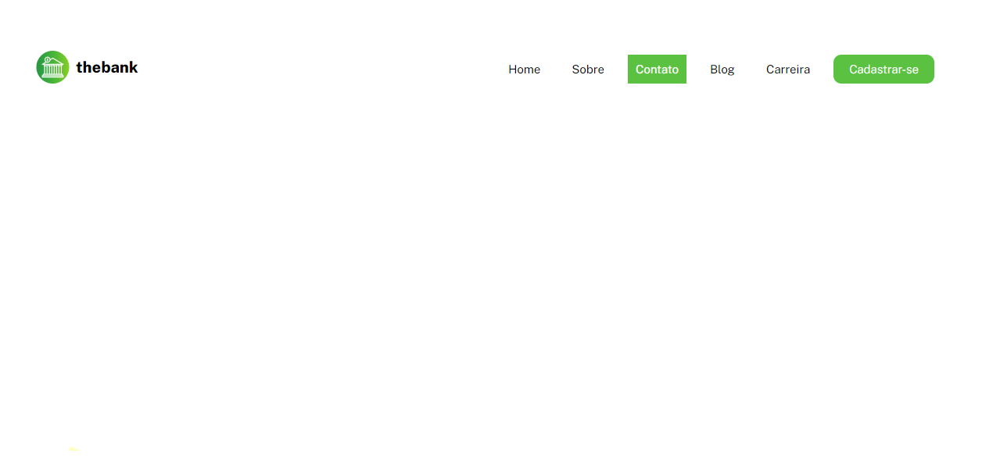
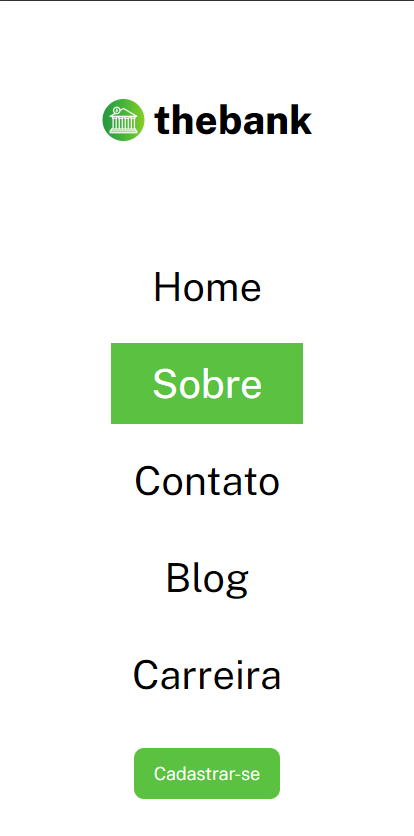

# Menu com flexbox

Esse foi uma exercício realizado no módulo "Exercícios CSS Avançado - Flexbox" do curso Dev Quest - Dev em Dobro 

#### Dificuldades e aprendizados

Durante a realização desse exercício não foi encontrada nenhuma dificuldade.

#### Design Desktop

#### Design Desktop
